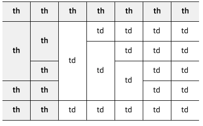

# rowspan에 대처가능한 테이블 만들기
### 설명
```
어떤 상황의 rowspan을 주어도 버텨내는 table입니다.  
```


### 대응
1. css3, JavaScript, jQuery를 사용하지 않습니다. ( IE8 )  
2. table의 border는 1px 입니다.
3. table을 제외한 어떤 태그에도 id 또는 class를 추가하지 않습니다.
4. data 형식의 테이블 이기 때문에 tbody에 th가 있습니다.
5. 테이블 양쪽에는 border가 없습니다.

### 소스
```html
<table class="">
	<thead>
		<tr>
			<th>th</th>
				"
				"
		</tr>
	</thead>
	<tbody>
		<tr>
			<th>th</th>
			<td>td</td>
				"
				"
		</tr>
	</tbody>
</table>
```