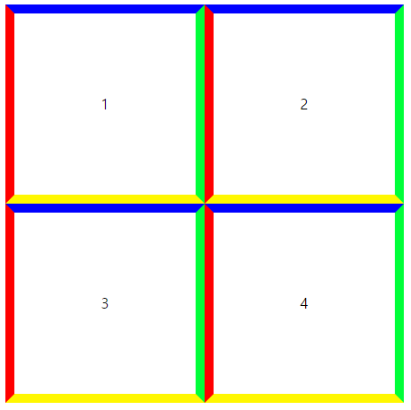
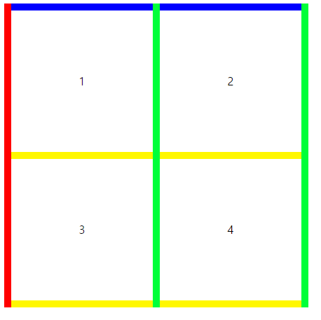

# 참고 설명

## border-collapse: separate | collapse  
> table 태그에만 적용되는 전용 속성  

### border-collapse: separate(세퍼릿);

> 인접 셀의 테두리를 분리하고 사이의 거리를 설정  

- border-spacing 은 border-collapse속성의 값이 separate 일 때 적용됩니다.  

``` css
table{
	border-collapse: separate;
	border-spacing:0;

	//border-spacing: 5px 30px;
}
```


### border-collapse: collapse;
> 인접 셀의 테두리를 하나의 테두리로 축소 

``` css
table{border-collapse: collapse;}
```
